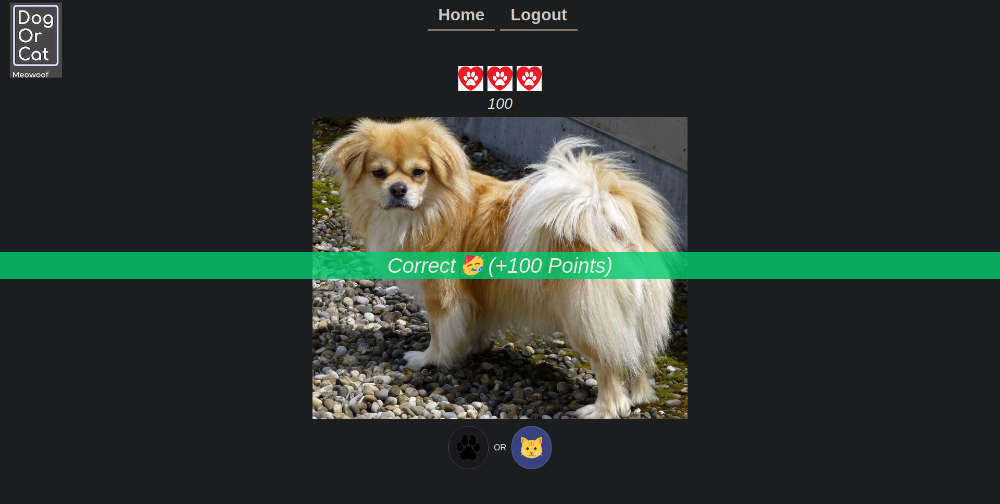

# Information Systems in the Web Assignment

We were tasked with the implementation of a web application with a secure authentication system, where we had to integrate at least one third-party API. Technologies used: Python, Django, JavaScript.

Implemented a game where the user is shown a blurred image and has to guess if it’s a cat or a dog. Images were pulled from two different APIs.

## Game Details

The goal of the game is to make correct guesses. For each guess you get 100 points and you can check your ranking in the leader-board page. Here is how the user is shown the blurred image(blur effect is toned down for demonstration purposes):

Here is a correct guess:  

## Implementation Details

The core of the game is in the following four endpoints:

-   `/app/`: This endpoint renders a HTML template for the start of the game. Using JavaScript we send a POST request to the following endpoint.
-   `start-game/`: After receiving the request we persist in the database the start of a game, using a SinglePlayerGame model instance and return the model's id in JSON.
-   `game/<game_id>/images/<number_of_images>/`: Using the game ID we just received we download the requested number of images, blur them, persist them in the database and return JSON with a list of URLs and IDs for the images.
-   `<question_id>/check_answer/`: As soon as the user answer's we send a request to this endpoint. We check if the user's guess is correct and increment a correct guesses answer in the database. The response contains the original image URL and a boolean showing if the guess was correct in JSON.

Since we have a specific URL for creating new images the user can keep playing the game for a long amount of time.

## Opportunities for Improvement

While working on this project we learned a lot of things and we realised that there is a lot of room for improvement. Specifically here are the things we would tackle first:

-   Downloading the images should be done in a worker thread, using a task queue like  [Celery](https://docs.celeryq.dev/en/stable/index.html "https://docs.celeryq.dev/en/stable/index.html")  or  [rq](https://python-rq.org/ "https://python-rq.org/"). This way we wouldn't block the main thread and we could also download images in parallel, to increase performance.
-   We should cache images, in order to reuse them for different games. This would help to limit the rate of requests to the APIs and boost performance.
-   Blurring should be done client side. By doing that we wouldn't waste computing time since, we could just blur the images the user would definitely see and no more.

## Contributors

- Christos Gkoutzigiannis: Backend implementation.
- Christos Leskos: Frontend implementation and design.